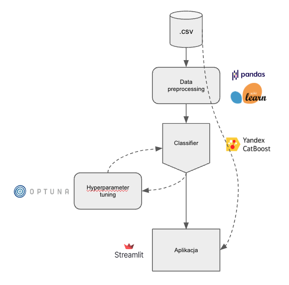

# Customer churn prediction and reduction.

## Intended project workflow

## Dataset
Cell2Cell Churn Dataset

source: https://www.kaggle.com/datasets/jpacse/datasets-for-churn-telecom/data?select=cell2celltrain.csv
 

## Repository structure
- README.md - Provides an overview of the project, installation instructions, and other essential information.
 - Makefile - Contains commands for building and managing the project through automated terminal tasks.
- data - Stores data files used or generated during the project.
- notebooks - Contains Jupyter notebooks for interactive data analysis and visualization.
- requirements.txt - Lists the Python dependencies required to reproduce the analysis environment.
- src - The source code directory, organized as follows:
  - constants.py - Defines project-wide constants.
  - data:
    - make_dataset.py - Scripts to download or generate data.
  - features:
    - build_features.py - Scripts to turn raw data into features for modeling.
  - models:
    - evaluate.py - Scripts for model evaluation.
    - model_config.py - Configuration file for model parameters.
    - train_model.py - Scripts for training the models.
  - visualization:
    - visualize.py - Scripts for creating exploratory and results-oriented visualizations.
